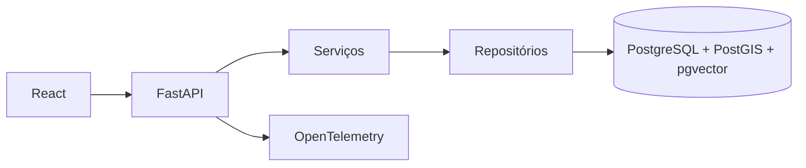

# Arquitetura inicial

```mermaid
flowchart LR
  UI[React] --> API[FastAPI]
  API --> SVC[Serviços]
  SVC --> REP[Repositórios]
  REP --> DB[(PostgreSQL + PostGIS + pgvector)]
  API --> OTEL[OpenTelemetry]
```

O domínio não depende de infraestrutura. Fluxos novos seguem adapter → service → repository → schema.
